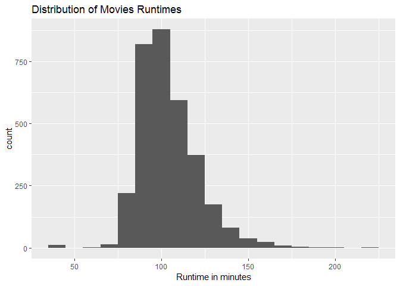

Visualizing One Numeric Variable
================

We are requested to answer these questions:

    1. What is the average movie runtime?
    2. Are there any outliers?
    3. How spread out are the movie runtimes?
    4. What is the shape of the runtime distribution?

Univariate visualizations of a quantitiative variable

Setup environment
-----------------

``` r
library(ggplot2)
```

    ## Warning: package 'ggplot2' was built under R version 3.5.2

``` r
movies = read.csv("../data/Movies.csv")
main_title <- "Distribution of Movies Runtimes"
x_lab = "Runtime in minutes"
```

Plot
----

Create dot plot

``` r
ggplot(
  data = movies,
  aes(x=Runtime, stat= "Count")) +
  geom_dotplot(binwidth = 1) +
  ggtitle(main_title) + 
  xlab(x_lab)
```


Create a Violin-Style dot plot

``` r
ggplot(
  data = movies,
  aes(x = Runtime, stat = "count")) +
  geom_dotplot(
    binwidth = 1,
    stackdir = "center") +
  ggtitle(main_title) +
  xlab(x_lab)
```


Boxplot
-------

Create box plot of runtime

``` r
ggplot(
  data = movies,
  aes(x= Runtime, y=Runtime)) +
  geom_boxplot() + 
  coord_flip() +
  ggtitle(main_title) + 
  xlab("") +
  ylab(x_lab) +
  theme(
    axis.text.y = element_blank(),
    axis.ticks.y = element_blank())
```

    ## Warning: Continuous x aesthetic -- did you forget aes(group=...)?


Histogram
---------

Create histogram with ggplot

``` r
ggplot(
data = movies,
aes(x = Runtime)) +
geom_histogram(binwidth = 10) +
  ggtitle(main_title) + 
  xlab(x_lab)
```



Density plot
------------

Create density plot with ggplot

``` r
ggplot(
  data = movies,
  aes(x=Runtime)) +
  geom_density() +
  ggtitle(main_title) +
  xlab(x_lab)
```


All in one
----------
