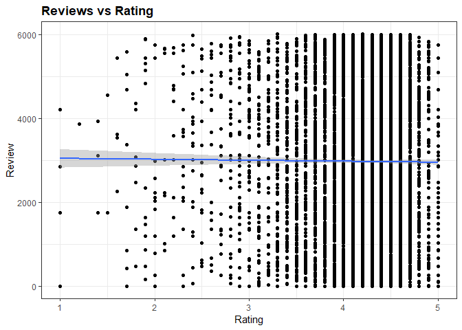
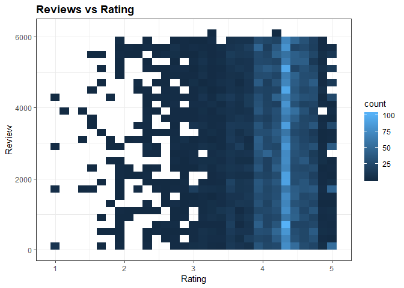
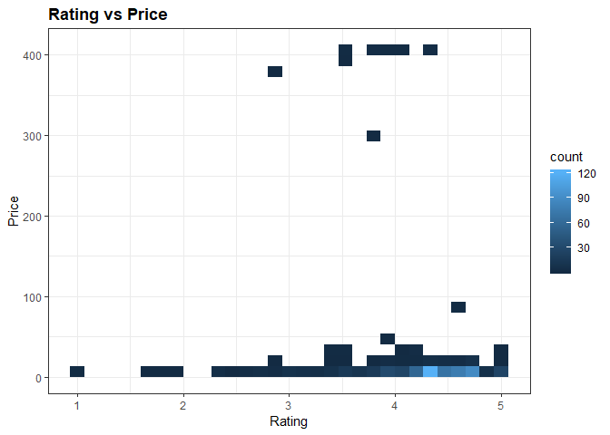

Data Visualization - Quantitative Bivariate Analysis
================

Data Load
=========

Let's start by taking a look to our current dataset

``` r
library(tidyverse)
```

    ## Warning: package 'tidyverse' was built under R version 3.5.2

    ## -- Attaching packages ------------------------------------------------------------------------- tidyverse 1.2.1 --

    ## v ggplot2 3.0.0     v purrr   0.2.5
    ## v tibble  1.4.2     v dplyr   0.7.6
    ## v tidyr   0.8.1     v stringr 1.3.1
    ## v readr   1.1.1     v forcats 0.3.0

    ## -- Conflicts ---------------------------------------------------------------------------- tidyverse_conflicts() --
    ## x dplyr::filter() masks stats::filter()
    ## x dplyr::lag()    masks stats::lag()

``` r
library(dslabs)
library(lattice)
```

    ## Warning: package 'lattice' was built under R version 3.5.2

``` r
load("rda/apps_dataset.rda")
load("rda/apps_categories_dataset.rda")
load("rda/apps_genres_dataset.rda")
load("rda/apps_versions_dataset.rda")
ds_theme_set()
```

Data Visualization
==================

Quantitative Bivariate Analysis
-------------------------------

Quantitative Features:

    * Ratings
    * Reviews
    * Size (Numeric)
    * Price
    * Last Updated
    * Installs (Numeric)

### Ratings vs Reviews

#### Scatterplot

``` r
title <- "Reviews vs Rating"
x_lab <- "Rating"
y_lab <- "Review"
z_lab <- "Density"
apps_versions_dataset %>%
  filter(!is.na(Rating)) %>%
  ggplot(aes(x=Rating, y=Reviews)) +
  geom_point() +
  ggtitle(title) +
  xlab(x_lab) +
  ylab(y_lab)
```


with linear regression, even we already know there is no correlation between those features.

``` r
apps_versions_dataset %>%
  filter(!is.na(Rating)) %>%
  ggplot(aes(x = Rating, y = Reviews)) +
  geom_point() +
  ggtitle(title) +
  xlab(x_lab) +
  ylab(y_lab) +
  geom_smooth(method = "lm")
```



#### Binned Frequency Heatmap

``` r
apps_versions_dataset %>%
  filter(!is.na(Rating)) %>%
  ggplot(aes(x= Rating, y = Reviews)) +
  stat_bin2d() +
  ggtitle(title)+
  xlab(x_lab) +
  ylab(y_lab)
```



#### Hexagonal Binned Frequency Heatmap

``` r
apps_versions_dataset %>%
  filter(!is.na(Rating)) %>%
  ggplot(aes(x=Rating, y=Reviews)) +
  stat_binhex() +
  ggtitle(title) +
  xlab(x_lab) +
  ylab(y_lab)
```

    ## Warning: package 'hexbin' was built under R version 3.5.2


#### Countour Plot

``` r
apps_versions_dataset %>%
  filter(!is.na(Rating)) %>%
  ggplot(aes(x = Rating, y = Reviews)) +
  geom_density2d() +
  ggtitle(title) +
  xlab(x_lab) +
  ylab(y_lab)
```


#### Level Plot

``` r
apps_versions_dataset %>%
  filter(!is.na(Rating)) %>%
  ggplot(aes(x = Rating, y =  Reviews)) +
  stat_density2d(aes(fill = ..level..), geom= "polygon") +
  ggtitle(title) +
  xlab(x_lab)+
  ylab(y_lab)
```


#### Mesh Plot

Creating the 2D kernel

``` r
library(MASS)
```

    ## Warning: package 'MASS' was built under R version 3.5.2

    ## 
    ## Attaching package: 'MASS'

    ## The following object is masked from 'package:dplyr':
    ## 
    ##     select

``` r
temp_data <-
  apps_versions_dataset %>%
  filter(!is.na(Rating))
  

density2d <- kde2d(
  x = temp_data$Rating,
  y = temp_data$Reviews,
  n = 50)

grid <- expand.grid(
  x = density2d$x,
  y = density2d$y)

grid$z <- as.vector(density2d$z)

head(grid)
```

    ##          x y            z
    ## 1 1.000000 2 7.991171e-06
    ## 2 1.081633 2 3.468052e-06
    ## 3 1.163265 2 2.834726e-07
    ## 4 1.244898 2 4.364022e-09
    ## 5 1.326531 2 1.269770e-11
    ## 6 1.408163 2 2.829820e-11

``` r
grid %>%
  wireframe(
  x = z ~ x * y ,
  main = title,
  xlab= x_lab,
  ylab = y_lab,
  zlab = z_lab
)
```


#### Surface Plot

for the sake of practice, I am repeating the process to create the grid object

``` r
temp_data <- apps_versions_dataset%>%
  filter(!is.na(Rating)) 

density2d <- kde2d(
  x =  temp_data$Rating,
  y = temp_data$Reviews,
  n = 50)

grid <- expand.grid(
  x = density2d$x,
  y = density2d$y)

grid$z = as.vector(density2d$z)

head(grid)
```

    ##          x y            z
    ## 1 1.000000 2 7.991171e-06
    ## 2 1.081633 2 3.468052e-06
    ## 3 1.163265 2 2.834726e-07
    ## 4 1.244898 2 4.364022e-09
    ## 5 1.326531 2 1.269770e-11
    ## 6 1.408163 2 2.829820e-11

``` r
grid %>%
  wireframe(
    x = z ~ x * y,
    drape = TRUE,
    main = title,
    xlab = x_lab,
    ylab = y_lab,
    zlab = z_lab)
```


### Ratings vs Size

#### Scatterplot

We can see there is no correlation between App Rating and size

``` r
title <- "Ratings vs Size"
y_lab <- "Size"

apps_versions_dataset %>%
  filter(!is.na(Rating)) %>%
  ggplot(aes(x = Rating, y = SizeNumeric)) +
  geom_point() +
  ggtitle(title)
```


``` r
apps_versions_dataset %>%
  filter(!is.na(Rating)) %>%
  ggplot(aes(x = Rating, y = SizeNumeric)) +
  geom_point() +
  geom_smooth(method = "lm") +
  ggtitle(title) +
  xlab(x_lab) +
  ylab(y_lab)
```


#### Binned Frequency Heatmap

``` r
apps_versions_dataset %>%
  filter(!is.na(Rating)) %>%
  ggplot(aes(x=Rating, y = SizeNumeric)) +
  stat_bin2d() +
  ggtitle (title) +
  xlab(x_lab) +
  ylab(y_lab)
```


#### Hexagonal Binned Frequency Heatmap

``` r
apps_versions_dataset %>%
  filter(!is.na(Rating)) %>%
  ggplot(aes(x = Rating, y = SizeNumeric)) +
  stat_binhex() +
  ggtitle(title)+
  xlab(x_lab)+
  ylab(y_lab)
```


#### Countour Plot

``` r
apps_versions_dataset %>%
  filter(!is.na(Rating)) %>%
  ggplot(aes(x = Rating, y = SizeNumeric)) +
  geom_density2d() +
  ggtitle(title) +
  xlab(x_lab) +
  ylab(y_lab)
```


#### Level Plot

``` r
apps_versions_dataset %>%
  filter(!is.na(Rating)) %>%
  ggplot(aes(x = Rating, y = SizeNumeric)) +
  stat_density2d(aes(fill = ..level..), geom = "polygon") +
  ggtitle(title) +
  xlab(x_lab) +
  ylab(y_lab)
```


#### Mesh Plot

``` r
temp_data <- apps_versions_dataset %>% filter(!is.na(Rating))

density2d <- kde2d(
  x = temp_data$Rating,
  y = temp_data$SizeNumeric,
  n = 50)

grid <- expand.grid(
  x = density2d$x,
  y = density2d$y)

grid$z <- as.vector(density2d$z)

grid %>%
  wireframe(
    x = z ~ x * y,
    main = title,
    xlab = x_lab,
    ylab = y_lab,
    zlab = z_lab)
```


#### Surface Plot

``` r
temp_data <- apps_versions_dataset %>%
  filter(!is.na(Rating))
  
density2d <- kde2d(
  x = temp_data$Rating,
  y = temp_data$SizeNumeric,
  n = 50)  

grid <- expand.grid(
  x = density2d$x,
  y = density2d$y)

grid$z <- as.vector(density2d$z)

grid %>%
  wireframe(
    x = z ~ x * y, 
    drape = TRUE,
    main = title,
    xlab = x_lab,
    ylab = y_lab,
    zlab = z_lab)
```


### Ratings vs Price

#### Scatterplot

``` r
title <- "Rating vs Price"
x_lab <- "Rating"
y_lab <- "Price"

apps_versions_dataset %>%
  filter(!is.na(Rating) & Type == "Paid") %>%
  ggplot(aes(x= Rating, y = PriceNumeric)) +
  geom_point() +
  ggtitle(title) +
  xlab(x_lab) +
  ylab(y_lab)
```


``` r
apps_versions_dataset %>% 
  filter(!is.na(Rating) & Type == "Paid") %>%
  ggplot(aes(x = Rating, y = PriceNumeric)) +
  geom_point() +
  ggtitle(title) +
  xlab(x_lab) +
  ylab(y_lab) +
  geom_smooth(method = "lm")
```

 Taking a look at the graph above, one can think about some correlation between low price better rating... but this may be an example of correlation is not causation...

#### Binned Frequency Heatmap

``` r
apps_versions_dataset %>%
  filter(!is.na(Rating) & Type == "Paid") %>%
  ggplot(aes(x = Rating, y = PriceNumeric)) +
  stat_bin2d() +
  ggtitle(title) +
  xlab (x_lab) +
  ylab (y_lab)
```



#### Hexagonal Binned Frequency Heatmap

``` r
apps_versions_dataset %>%
  filter(!is.na(Rating) & Type == "Paid") %>%
  ggplot(aes(x = Rating, y = PriceNumeric)) +
  stat_binhex() +
  ggtitle(title) +
  xlab (x_lab) +
  ylab (y_lab)
```


#### Countour Plot

``` r
apps_versions_dataset %>%
  filter(!is.na(Rating) & Type == "Paid")  %>%
  ggplot(aes(x = Rating, y = PriceNumeric)) +
  geom_density2d() +
  ggtitle(title) +
  xlab(x_lab) +
  ylab(y_lab)
```


#### Level Plot

``` r
apps_versions_dataset %>%
  filter(!is.na(Rating) & Type == "Paid")  %>%
  ggplot(aes(x = Rating, y = PriceNumeric)) +
  stat_density2d(aes(fill = ..level..), geom = "polygon") +
  ggtitle(title) +
  xlab(x_lab) +
  ylab(y_lab)
```


#### Mesh Plot

``` r
temp_data <- apps_versions_dataset %>% filter(!is.na(Rating) & Type == "Paid")

density2d <- kde2d(
  x = temp_data$Rating,
  y = temp_data$PriceNumeric,
  n = 50)

grid <- expand.grid(
  x = density2d$x,
  y = density2d$y)


grid$z <- as.vector(density2d$z)

grid %>% 
  wireframe(
  x = z ~ x * y,
  main = title,
  xlab = x_lab,
  ylab = y_lab,
  zlab = z_lab)
```


#### Surface Plot

``` r
temp_data <- apps_versions_dataset %>% filter(!is.na(Rating) & Type == "Paid") 

density2d <- kde2d(
  x = temp_data$Rating,
  y = temp_data$PriceNumeric,
  n = 50)

grid <- expand.grid(
  x = density2d$x,
  y = density2d$y)

grid$z <- as.vector(density2d$z)

grid %>%
  wireframe(
    x = z ~ x * y,
    drape = TRUE,
    main = title,
    xlab = x_lab,
    ylab = y_lab,
    zlab = z_lab)
```


### Size vs Price

#### Scatterplot

#### Binned Frequency Heatmap

#### Hexagonal Binned Frequency Heatmap

#### Countour Plot

#### Level Plot

#### Mesh Plot

#### Surface Plot

### Ratings vs Last Updated

#### Step Chart

#### Line Chart

#### Area chart

### Apps vs Last Updated

#### Step Chart

#### Line Chart

#### Area chart
