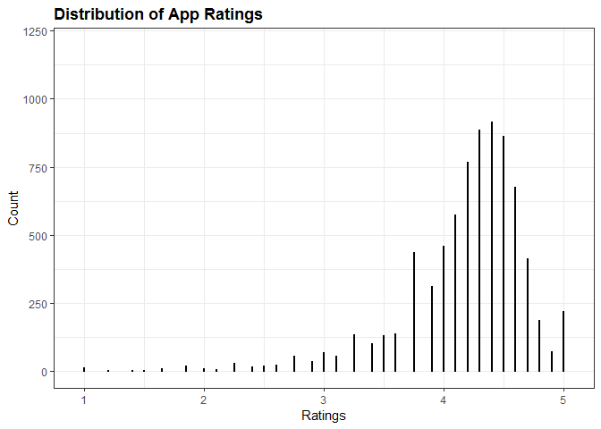

Data Visualization - Quantitative Univariate Analysis
================

Data Load
=========

Let's start by taking a look to our current dataset

``` r
library(tidyverse)
```

    ## ── Attaching packages ────────────────────────────────────────────────────────────────────────────────────────────────── tidyverse 1.2.1 ──

    ## ✔ ggplot2 3.1.0       ✔ purrr   0.3.1  
    ## ✔ tibble  2.0.1       ✔ dplyr   0.8.0.1
    ## ✔ tidyr   0.8.3       ✔ stringr 1.4.0  
    ## ✔ readr   1.3.1       ✔ forcats 0.4.0

    ## ── Conflicts ───────────────────────────────────────────────────────────────────────────────────────────────────── tidyverse_conflicts() ──
    ## ✖ dplyr::filter() masks stats::filter()
    ## ✖ dplyr::lag()    masks stats::lag()

``` r
library(ggplot2)
library(dslabs)
library(forcats)

load("rda/apps_dataset.rda")
load("rda/apps_categories_dataset.rda")
load("rda/apps_genres_dataset.rda")
load("rda/apps_versions_dataset.rda")
ds_theme_set()
```

Data Visualization
==================

So now our data is loaded, let's start by making questions that may fit on the course structure.

Quantitative Univariate Analysis
--------------------------------

**Questions to answer**

    * What is the app rating mean/max/min?
    * What is the app reviews mean/max/min?
    * What is the app size mean/max/min?
    * What is the app average price for an app?
    * What is the app installation distribution?
    * Are apps popularity in 2018 still high in comprarisson to previous years?

### What is the app rating mean/max/min?

Setting up initial variables

``` r
title <- "Distribution of App Ratings"
x_lab <- "Ratings"
y_lab <- "Count"
```

#### Dot Plot

As pointed out in this [link](https://ggplot2.tidyverse.org/reference/geom_dotplot.html) :

*When binning along the x axis and stacking along the y axis, the numbers on y axis are not meaningful, due to technical limitations of ggplot2. You can hide the y axis, as in one of the examples, or manually scale it to match the number of dots.*

So we also specify the y axis scale and the dot size, so we can display an approximation to the real distribution.

``` r
apps_versions_dataset %>%
  filter(!is.na(Rating)) %>%
  ggplot(aes(x = Rating, stat = "Count")) +
  geom_dotplot(binwidth = .1, dotsize = .018) +
  ggtitle(title) +
  xlab(x_lab) +
  ylab(y_lab) +
  scale_y_continuous(limits = c(-1, 1200))
```



#### Answer

*Question: What is the app rating mean/max/min?*

### What is the app reviews mean/max/min?

#### Answer

*Question: What is the app reviews mean/max/min?*

### What is the app size mean/max/min?

#### Answer

*Question: What is the app size mean/max/min?*

### What is the app average price for an app?

#### Answer

*Question: What is the app average price for an app?*

### What is the app installation distribution?

#### Answer

*Question: What is the app installation distribution?*

### Are apps popularity in 2018 still high in comprarisson to previous years?

#### Answer

*Question: Are apps popularity in 2018 still high in comprarisson to previous years?*
