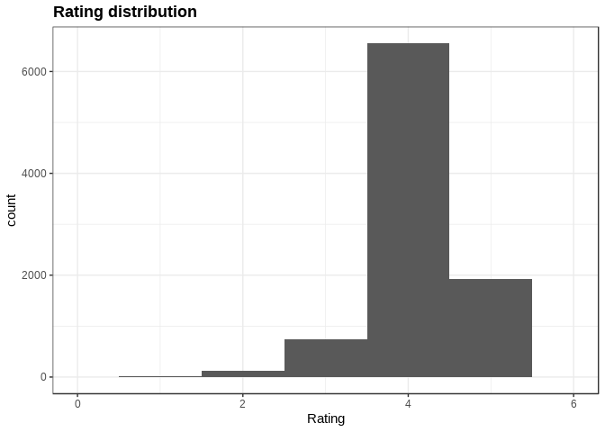
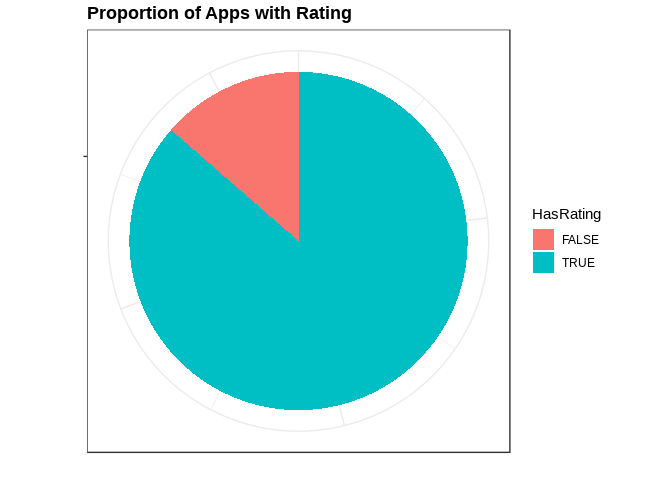
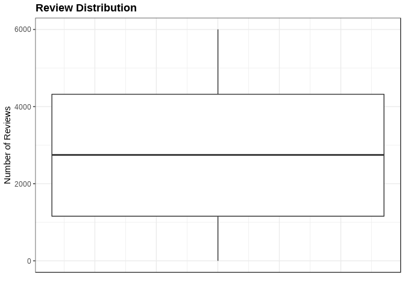
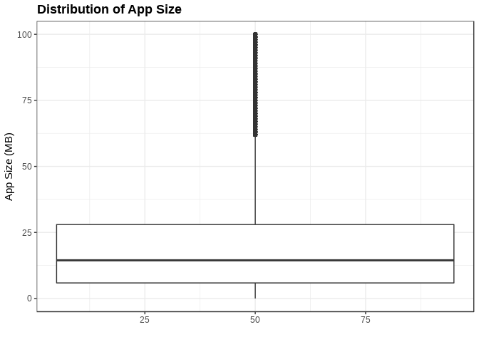
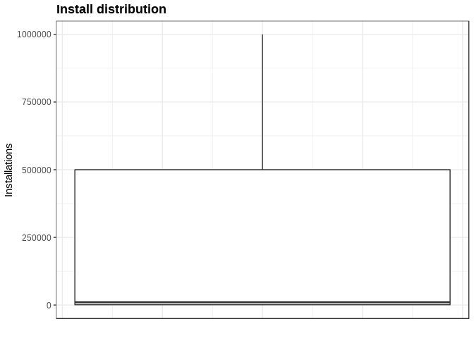

Google Play Apps
================

Data Visualization of Google Play Apps
======================================

Dataset Description
-------------------

Dataset downloaded from: <https://www.kaggle.com/lava18/google-play-store-apps>

Loading the dataset

``` r
library(tidyverse)
library(ggplot2)
library(lattice)
library(latticeExtra)
library(lubridate)
library(dslabs)

ds_theme_set()
apps_dataset_original = read.csv("../../data/googleplaystore.csv", header = TRUE, sep = ",")

#class(apps_dataset)
head(as.tibble(apps_dataset_original))
```

    ## # A tibble: 6 x 13
    ##   App   Category Rating Reviews Size  Installs Type  Price Content.Rating
    ##   <fct> <fct>     <dbl> <fct>   <fct> <fct>    <fct> <fct> <fct>         
    ## 1 Phot… ART_AND…    4.1 159     19M   10,000+  Free  0     Everyone      
    ## 2 Colo… ART_AND…    3.9 967     14M   500,000+ Free  0     Everyone      
    ## 3 U La… ART_AND…    4.7 87510   8.7M  5,000,0… Free  0     Everyone      
    ## 4 Sket… ART_AND…    4.5 215644  25M   50,000,… Free  0     Teen          
    ## 5 Pixe… ART_AND…    4.3 967     2.8M  100,000+ Free  0     Everyone      
    ## 6 Pape… ART_AND…    4.4 167     5.6M  50,000+  Free  0     Everyone      
    ## # … with 4 more variables: Genres <fct>, Last.Updated <fct>,
    ## #   Current.Ver <fct>, Android.Ver <fct>

Data wrangling
--------------

Let's confirm the column types are correct and also the values.

### App Feature

From previous point, we can see the App column, which contains app names, is factor data type, we need to change it to character.

``` r
apps_dataset_original = read.csv("../../data/googleplaystore.csv", header = TRUE, sep = ",", as.is = c("App"))

head(as.tibble(apps_dataset_original))
```

    ## # A tibble: 6 x 13
    ##   App   Category Rating Reviews Size  Installs Type  Price Content.Rating
    ##   <chr> <fct>     <dbl> <fct>   <fct> <fct>    <fct> <fct> <fct>         
    ## 1 Phot… ART_AND…    4.1 159     19M   10,000+  Free  0     Everyone      
    ## 2 Colo… ART_AND…    3.9 967     14M   500,000+ Free  0     Everyone      
    ## 3 U La… ART_AND…    4.7 87510   8.7M  5,000,0… Free  0     Everyone      
    ## 4 Sket… ART_AND…    4.5 215644  25M   50,000,… Free  0     Teen          
    ## 5 Pixe… ART_AND…    4.3 967     2.8M  100,000+ Free  0     Everyone      
    ## 6 Pape… ART_AND…    4.4 167     5.6M  50,000+  Free  0     Everyone      
    ## # … with 4 more variables: Genres <fct>, Last.Updated <fct>,
    ## #   Current.Ver <fct>, Android.Ver <fct>

### Incorrect record

In a later analysis has been detected a broken record, but since this affects to the rest of conversions has been moved into this first steps.

``` r
apps_dataset_original %>%
  filter(Category == "1.9") %>%
  head()  
```

    ##                                       App Category Rating Reviews   Size
    ## 1 Life Made WI-Fi Touchscreen Photo Frame      1.9     19    3.0M 1,000+
    ##   Installs Type    Price Content.Rating            Genres Last.Updated
    ## 1     Free    0 Everyone                February 11, 2018       1.0.19
    ##   Current.Ver Android.Ver
    ## 1  4.0 and up

So we can see the Category feature is missing, and the rest of the values are shift to the left, so we can fix it, and the best option is to do it from the begining. So we need to find the best category, based on the app name.

``` r
apps_dataset_original %>% 
  filter(str_detect(App,"photo")) %>%
  select(Category) %>%
  head()
```

    ##         Category
    ## 1 ART_AND_DESIGN
    ## 2         BEAUTY
    ## 3         DATING
    ## 4         EVENTS
    ## 5    PHOTOGRAPHY
    ## 6    PHOTOGRAPHY

"PHOTOGRAPHY" category seems to be the most properly for this app

``` r
col_number <- ncol(apps_dataset_original)
rows_indx <- apps_dataset_original[,1] == "Life Made WI-Fi Touchscreen Photo Frame"
apps_dataset_original[rows_indx,3:col_number]  <- apps_dataset_original[rows_indx,2:(col_number-1)]
```

    ## Warning in `[<-.factor`(`*tmp*`, iseq, value = structure(1L, .Label =
    ## c("", : invalid factor level, NA generated

``` r
apps_dataset_original[rows_indx,2] <- "PHOTOGRAPHY"

apps_dataset_original %>%
  filter(App == "Life Made WI-Fi Touchscreen Photo Frame") %>%
  head()  
```

    ##                                       App    Category Rating Reviews Size
    ## 1 Life Made WI-Fi Touchscreen Photo Frame PHOTOGRAPHY      1      19 3.0M
    ##   Installs Type Price Content.Rating Genres      Last.Updated Current.Ver
    ## 1   1,000+ Free     0       Everyone   <NA> February 11, 2018      1.0.19
    ##   Android.Ver
    ## 1  4.0 and up

Now Genres feature has NA,let's see if we can set any that makes sense

``` r
apps_dataset_original %>% filter(Category == "PHOTOGRAPHY")%>% select(Genres) %>% distinct(Genres)
```

    ##        Genres
    ## 1 Photography
    ## 2        <NA>

So for Category = "PHOTOGRAPHY" we must set Genres = "Photography"

``` r
apps_dataset_original[rows_indx,10] <- "Photography"
apps_dataset_original[rows_indx,3] <- 1.9
apps_dataset_original %>%
  filter(App == "Life Made WI-Fi Touchscreen Photo Frame") %>%
  head()  
```

    ##                                       App    Category Rating Reviews Size
    ## 1 Life Made WI-Fi Touchscreen Photo Frame PHOTOGRAPHY    1.9      19 3.0M
    ##   Installs Type Price Content.Rating      Genres      Last.Updated
    ## 1   1,000+ Free     0       Everyone Photography February 11, 2018
    ##   Current.Ver Android.Ver
    ## 1      1.0.19  4.0 and up

``` r
#levels(apps_dataset_original$Genres)
```

### Rating feature

Let's take a look at those features that contains NAs

``` r
colnames(apps_dataset_original)[colSums(is.na(apps_dataset_original)) > 0]
```

    ## [1] "Rating"

Let's confirm how many observations there are with NA

We see Rating column is numeric

``` r
class(apps_dataset_original$Rating)
```

    ## [1] "numeric"

Therefore those recods are missing, it may be due to:

    * They are new and therefore there are no yet any rating
    * There may be a new version with no ratings yet.
    * Missing value
    * It may be around for a while and it has no download (or almost none)

``` r
apps_without_ratings <-  apps_dataset_original %>% 
  filter(is.na(Rating)) %>%
  nrow()

sprintf("There are %d without ratings", apps_without_ratings)
```

    ## [1] "There are 1474 without ratings"

**So far we are going to keep the observations that no contains ratings**

Let's explore the Ratings... we are going to convert them in categorical data to see the values easily

``` r
apps_dataset_original %>% 
  mutate(RatingTemp = round(Rating)) %>%
  filter(!is.na(RatingTemp)) %>%
  select(Rating, RatingTemp) %>%
  group_by(RatingTemp) %>%
  summarize()
```

    ## # A tibble: 5 x 1
    ##   RatingTemp
    ##        <dbl>
    ## 1          1
    ## 2          2
    ## 3          3
    ## 4          4
    ## 5          5

We found that there are **Ratings of 19!!!** this is not expected

Let take a closer look

``` r
apps_dataset_original %>%
  mutate(RatingTemp = round(Rating)) %>%
  group_by(RatingTemp) %>%
  summarize(count = n())
```

    ## # A tibble: 6 x 2
    ##   RatingTemp count
    ##        <dbl> <int>
    ## 1          1    20
    ## 2          2   131
    ## 3          3   583
    ## 4          4  6716
    ## 5          5  1917
    ## 6        NaN  1474

Validating if there are more Ratings out of range

``` r
apps_dataset_original %>% 
  filter(Rating > 5.0 | Rating < 0) %>%
  count()
```

    ## # A tibble: 1 x 1
    ##       n
    ##   <int>
    ## 1     0

**There is only one app with Rating 19, it may be 1.9, I am taking the decision of changing the value to 1.9**

``` r
apps_dataset <- apps_dataset_original
head(as.tibble(apps_dataset$Rating))
```

    ## # A tibble: 6 x 1
    ##   value
    ##   <dbl>
    ## 1   4.1
    ## 2   3.9
    ## 3   4.7
    ## 4   4.5
    ## 5   4.3
    ## 6   4.4

``` r
rating_indexes <- !is.na(apps_dataset[,3]) & apps_dataset[,3] > 5.0

apps_dataset[rating_indexes,3] <- apps_dataset[rating_indexes,3] * 0.1
```

Validating the change has been applied

``` r
apps_dataset %>%
  mutate(RatingTemp = round(Rating)) %>%
  group_by(RatingTemp) %>%
  summarize(count = n())
```

    ## # A tibble: 6 x 2
    ##   RatingTemp count
    ##        <dbl> <int>
    ## 1          1    20
    ## 2          2   131
    ## 3          3   583
    ## 4          4  6716
    ## 5          5  1917
    ## 6        NaN  1474

``` r
apps_dataset %>%
  ggplot(aes(x= Rating))+
  coord_cartesian(xlim = c(0,6)) +
  geom_histogram(bins=5) + 
  ggtitle("Rating distribution")
```

    ## Warning: Removed 1474 rows containing non-finite values (stat_bin).



Taking a look at the proportion between those that don't have Ratings

``` r
apps_dataset %>% 
  mutate(HasRating = !is.na(Rating)) %>%
  ggplot(aes(x ="", fill = HasRating)) +
  geom_bar() +
  coord_polar(theta = "y") +
  ggtitle("Proportion of Apps with Rating") +
  ylab("") +
  xlab("") +
  theme(axis.text.x = element_blank(),
        axis.ticks.x = element_blank())
```



### Reviews Feature

We see this feature is set as factor when it must be numeric

``` r
apps_dataset %>%
  filter(is.na(as.numeric(Reviews))) %>%
  select(App)
```

    ## [1] App
    ## <0 rows> (or 0-length row.names)

So, Reviews contains only numeric entries, so we convert those explicit

``` r
apps_dataset <-  apps_dataset %>% 
  mutate(Reviews = as.numeric(Reviews))

head(as.tibble(apps_dataset))
```

    ## # A tibble: 6 x 13
    ##   App   Category Rating Reviews Size  Installs Type  Price Content.Rating
    ##   <chr> <fct>     <dbl>   <dbl> <fct> <fct>    <fct> <fct> <fct>         
    ## 1 Phot… ART_AND…    4.1    1183 19M   10,000+  Free  0     Everyone      
    ## 2 Colo… ART_AND…    3.9    5924 14M   500,000+ Free  0     Everyone      
    ## 3 U La… ART_AND…    4.7    5681 8.7M  5,000,0… Free  0     Everyone      
    ## 4 Sket… ART_AND…    4.5    1947 25M   50,000,… Free  0     Teen          
    ## 5 Pixe… ART_AND…    4.3    5924 2.8M  100,000+ Free  0     Everyone      
    ## 6 Pape… ART_AND…    4.4    1310 5.6M  50,000+  Free  0     Everyone      
    ## # … with 4 more variables: Genres <fct>, Last.Updated <fct>,
    ## #   Current.Ver <fct>, Android.Ver <fct>

The Reviews feature is now numeric, let's check if there are NAs

``` r
na_counter <-sum(is.na(apps_dataset[,4]))
sprintf("There are %d Reviews with NA", na_counter)
```

    ## [1] "There are 0 Reviews with NA"

So we are done with this feature.

``` r
apps_dataset %>%
  group_by(Category) %>%
  summarize(count = n(), max = max(Reviews), min = min(Reviews))
```

    ## # A tibble: 33 x 4
    ##    Category            count   max   min
    ##    <fct>               <int> <dbl> <dbl>
    ##  1 ART_AND_DESIGN         65  5924     1
    ##  2 AUTO_AND_VEHICLES      85  5988     1
    ##  3 BEAUTY                 53  5914     1
    ##  4 BOOKS_AND_REFERENCE   231  5947     1
    ##  5 BUSINESS              460  5954     1
    ##  6 COMICS                 60  5994     2
    ##  7 COMMUNICATION         387  5995     1
    ##  8 DATING                234  5940     1
    ##  9 EDUCATION             156  5979   166
    ## 10 ENTERTAINMENT         149  5989    85
    ## # … with 23 more rows

``` r
max_value <- max(apps_dataset$Reviews)
min_value <- min(apps_dataset$Reviews)
sprintf("Max value %d, Min value %d", max_value, min_value)
```

    ## [1] "Max value 6002, Min value 1"

Let's take a quick view to the current data, sowe may see any unexpected value

``` r
apps_dataset %>%
  ggplot(aes(x = Reviews, y = Reviews)) +
  geom_boxplot() +
  ggtitle("Review Distribution") +
  xlab("") +
  ylab("Number of Reviews") +
  theme(
    axis.text.x = element_blank(),
    axis.ticks.x = element_blank()
  )
```

    ## Warning: Continuous x aesthetic -- did you forget aes(group=...)?



### Size Feature

This feature seems to be useful if we use it as numeric, anyway we need to remove the 'M' character, but we are not sure if there are other measurement units, such as GB, KB, etc.

``` r
apps_dataset %>% 
  mutate(SizeNumeric = as.numeric(Size)) %>%
  filter(is.na(SizeNumeric)) %>% 
  select(Size, SizeNumeric) %>% head(n = 30)
```

    ## [1] Size        SizeNumeric
    ## <0 rows> (or 0-length row.names)

**Interesting** the conversion does not fail, but the converted values are not the expected ones. so we are going to proceed to remove all non numeric characters, following this convention:

    * All values measure using M, will get rid of M, and converted
    * All values measure using k, will get rid of k, and converted into M scale
    * All values measure using +, will get rid of +, and as kept into M scale
    * 'Varies with device' will be set as NA

Those conventions were determined after some data exploration, you can see in the code below all we have remove

``` r
pattern <- "(M[a-zA-Z]+)|([a-jl-zA-LN-Z])"

apps_dataset %>% filter(str_detect(Size, pattern = pattern) & Size != 'Varies with device') %>%
  select(App, Size) %>% 
  group_by(Size) %>%
  summary()
```

    ## Warning: Factor `Size` contains implicit NA, consider using
    ## `forcats::fct_explicit_na`

    ##      App                 Size  
    ##  Length:0           1,000+ :0  
    ##  Class :character   1.0M   :0  
    ##  Mode  :character   1.1M   :0  
    ##                     1.2M   :0  
    ##                     1.3M   :0  
    ##                     1.4M   :0  
    ##                     (Other):0

So We have detected that also k is added to the app size measurement, the observation is added to the previous list

#### Create new Size column with the numeric type only

``` r
apps_dataset <- apps_dataset %>%
  mutate(SizeNumeric = case_when(
    !is.na(Size) & str_detect(Size,"M$") ~ as.numeric(str_replace(Size,"M$","")),
    !is.na(Size) & str_detect(Size,"k$") ~  round(as.numeric(str_replace(Size,"k$",""))/1024,3),
    Size == "Varies with device" ~ mean(NA),
    TRUE ~ as.numeric(NA)
  ))
```

    ## Warning in eval_tidy(pair$rhs, env = default_env): NAs introduced by
    ## coercion

    ## Warning in eval_tidy(pair$rhs, env = default_env): NAs introduced by
    ## coercion

We may consider to set the average size for those apps set as "Varies with device"... let's see what is the proportion.

``` r
proportion_of_size <- sum(str_detect(apps_dataset$Size,"^Varies with device$"))/nrow(apps_dataset)
sprintf("Proportion of Size set as 'Varies with device': %f", proportion_of_size)
```

    ## [1] "Proportion of Size set as 'Varies with device': 0.156351"

**This is the 15.6%, it is too high... I am going to fill out it with the mean according to its category**

``` r
size_summary <-  apps_dataset %>% 
  filter(!str_detect(Size, "^Varies with device$")) %>%
  group_by(Category) %>%
  select(Category, SizeNumeric) %>%
  summarize(Mean=round(mean(SizeNumeric),3))

apps_dataset <- apps_dataset %>%
  group_by(Category) %>%
  mutate(SizeNumeric = case_when(
    is.na(SizeNumeric) ~ mean(SizeNumeric[!is.na(SizeNumeric)]),
    TRUE ~ SizeNumeric)) %>%
  ungroup()
  
# Validating
apps_dataset %>%
  filter(str_detect(Size,"^Varies with device$")) %>%
  group_by(Category) %>%
  select(Category,Size, SizeNumeric) %>%
  head(n=10)
```

    ## # A tibble: 10 x 3
    ## # Groups:   Category [2]
    ##    Category          Size               SizeNumeric
    ##    <fct>             <fct>                    <dbl>
    ##  1 ART_AND_DESIGN    Varies with device        12.4
    ##  2 ART_AND_DESIGN    Varies with device        12.4
    ##  3 AUTO_AND_VEHICLES Varies with device        20.0
    ##  4 AUTO_AND_VEHICLES Varies with device        20.0
    ##  5 AUTO_AND_VEHICLES Varies with device        20.0
    ##  6 AUTO_AND_VEHICLES Varies with device        20.0
    ##  7 AUTO_AND_VEHICLES Varies with device        20.0
    ##  8 AUTO_AND_VEHICLES Varies with device        20.0
    ##  9 AUTO_AND_VEHICLES Varies with device        20.0
    ## 10 AUTO_AND_VEHICLES Varies with device        20.0

Now let's see the current data

``` r
apps_dataset %>% 
  ggplot(aes(x = SizeNumeric, y = SizeNumeric)) +
  geom_boxplot() +
  ggtitle("Distribution of App Size") +
  xlab("") +
  ylab("App Size (MB)")
```

    ## Warning: Continuous x aesthetic -- did you forget aes(group=...)?



``` r
  theme(
    axis.text.x = element_blank(),
    axis.ticks.x = element_blank())
```

    ## List of 2
    ##  $ axis.text.x : list()
    ##   ..- attr(*, "class")= chr [1:2] "element_blank" "element"
    ##  $ axis.ticks.x: list()
    ##   ..- attr(*, "class")= chr [1:2] "element_blank" "element"
    ##  - attr(*, "class")= chr [1:2] "theme" "gg"
    ##  - attr(*, "complete")= logi FALSE
    ##  - attr(*, "validate")= logi TRUE

**At first sight all app sizes seem to be ok, it is expeted to have some few very big apps.**

### Install feature

We may need to keep it as factor, but we also will need it as numeric, so we are creating a second column with those values

we need to remove: **",","+" **

``` r
options(scipen = 999) # Disabling scientific notation
apps_dataset <- apps_dataset %>% 
  mutate(InstallsNumeric = str_replace_all(Installs, "[,*+$]", "")) %>%
  mutate(InstallsNumeric = as.integer(InstallsNumeric))

na_counter <- apps_dataset %>% 
    filter(is.na(InstallsNumeric)) %>%
    count()

sprintf("There are %d NAs", sum(na_counter))
```

    ## [1] "There are 0 NAs"

``` r
summary(apps_dataset$InstallsNumeric)
```

    ##       Min.    1st Qu.     Median       Mean    3rd Qu.       Max. 
    ##          0       1000     100000   15462913    5000000 1000000000

There are no NA, it used to be due to the incorrect observation fixed at the beginning... But the current distribution is really odd

``` r
apps_dataset %>% select(Installs,InstallsNumeric) %>% head()
```

    ## # A tibble: 6 x 2
    ##   Installs    InstallsNumeric
    ##   <fct>                 <int>
    ## 1 10,000+               10000
    ## 2 500,000+             500000
    ## 3 5,000,000+          5000000
    ## 4 50,000,000+        50000000
    ## 5 100,000+             100000
    ## 6 50,000+               50000

``` r
apps_dataset %>%
  ggplot(aes(x=50, y = InstallsNumeric)) +
  geom_boxplot() +
  ggtitle("Install distribution") +
  xlab("") +
  ylab("Installations") +
  theme(
    axis.text.x = element_blank(),
    axis.ticks.x = element_blank())
```


The outliers are really affecting our current box plot view...let remove those in order for usto be the main data.

``` r
apps_dataset %>%
  filter(InstallsNumeric <=1000000) %>%
  ggplot(aes(x=50, y = InstallsNumeric)) +
  geom_boxplot() +
  ggtitle("Install distribution") +
  xlab("") +
  ylab("Installations") +
  theme(
    axis.text.x = element_blank(),
    axis.ticks.x = element_blank())
```



After taking a comparisson between Installations and InstallationNumeric columns, we can see the numbers are correct, and the distribution is really long. We will analyse later in depth

### Price feature

The price feature is set as factor, we need to convert it to numeric

``` r
apps_dataset %>%
  filter(is.na(as.numeric(Price))) %>%
  group_by(Type) %>%
  select(Type) %>%
  summary()
```

    ## Warning: Factor `Type` contains implicit NA, consider using
    ## `forcats::fct_explicit_na`

    ##    Type  
    ##  0   :0  
    ##  Free:0  
    ##  NaN :0  
    ##  Paid:0

There are no NAs

Let's validate there are no format characters

``` r
apps_dataset %>%
  filter(str_detect(Price,pattern = "[a-zA-Z,$]")) %>%
  select(Price) %>%
  head()
```

    ## # A tibble: 6 x 1
    ##   Price
    ##   <fct>
    ## 1 $4.99
    ## 2 $4.99
    ## 3 $4.99
    ## 4 $4.99
    ## 5 $3.99
    ## 6 $3.99

There are format characters, so we need to clean up

``` r
apps_dataset <- apps_dataset %>% 
  mutate(PriceNumeric = as.numeric(str_replace_all(Price,pattern = "[a-zA-Z,$]","")))
```

**Is there any Free application with Price different from 0?**

``` r
apps_dataset %>%  filter(Type == 'Free' & Price != '0') %>% count()
```

    ## # A tibble: 1 x 1
    ##       n
    ##   <int>
    ## 1     0

**there is none**

**Is there any not free application but the price is 0?**

``` r
apps_dataset %>%  filter(Type != 'Free' & Price == '0') %>% count()
```

    ## # A tibble: 1 x 1
    ##       n
    ##   <int>
    ## 1     1

**There is detected one incorrect Type observation, it was missing Free for price = 0**, so this is why the line below is there.

``` r
apps_dataset %>%  filter(Type != 'Free' & Price == '0')
```

    ## # A tibble: 1 x 16
    ##   App   Category Rating Reviews Size  Installs Type  Price Content.Rating
    ##   <chr> <fct>     <dbl>   <dbl> <fct> <fct>    <fct> <fct> <fct>         
    ## 1 Comm… FAMILY      NaN       1 Vari… 0        NaN   0     Everyone 10+  
    ## # … with 7 more variables: Genres <fct>, Last.Updated <fct>,
    ## #   Current.Ver <fct>, Android.Ver <fct>, SizeNumeric <dbl>,
    ## #   InstallsNumeric <int>, PriceNumeric <dbl>

We didn't get any NA message when converting the Price column, but we are going to double check

``` r
apps_dataset %>%
  filter(is.na(PriceNumeric)) %>%
  count()
```

    ## # A tibble: 1 x 1
    ##       n
    ##   <int>
    ## 1     0

Let's check what is the max and min prices (for min we are expecting 0)

``` r
apps_dataset %>%  
  select(PriceNumeric) %>%
  summary(PriceNumeric) 
```

    ##   PriceNumeric    
    ##  Min.   :  0.000  
    ##  1st Qu.:  0.000  
    ##  Median :  0.000  
    ##  Mean   :  1.027  
    ##  3rd Qu.:  0.000  
    ##  Max.   :400.000

### Type feature

It has no specified the Type, so since the price is 0, we can assume the category is Free

``` r
apps_dataset %>%  filter(Type == 'NaN')
```

    ## # A tibble: 1 x 16
    ##   App   Category Rating Reviews Size  Installs Type  Price Content.Rating
    ##   <chr> <fct>     <dbl>   <dbl> <fct> <fct>    <fct> <fct> <fct>         
    ## 1 Comm… FAMILY      NaN       1 Vari… 0        NaN   0     Everyone 10+  
    ## # … with 7 more variables: Genres <fct>, Last.Updated <fct>,
    ## #   Current.Ver <fct>, Android.Ver <fct>, SizeNumeric <dbl>,
    ## #   InstallsNumeric <int>, PriceNumeric <dbl>

There is only one Type = "NaN", so we can fix it,since the Price = 0, we can set it Free.

``` r
apps_dataset$Type[apps_dataset$Type == "NaN"] <- "Free"
apps_dataset %>%  filter(Type == 'NaN' | App == "Command & Conquer: Rivals")
```

    ## # A tibble: 1 x 16
    ##   App   Category Rating Reviews Size  Installs Type  Price Content.Rating
    ##   <chr> <fct>     <dbl>   <dbl> <fct> <fct>    <fct> <fct> <fct>         
    ## 1 Comm… FAMILY      NaN       1 Vari… 0        Free  0     Everyone 10+  
    ## # … with 7 more variables: Genres <fct>, Last.Updated <fct>,
    ## #   Current.Ver <fct>, Android.Ver <fct>, SizeNumeric <dbl>,
    ## #   InstallsNumeric <int>, PriceNumeric <dbl>

### Last updated feature

We also need to set the dates in a valid format

Let's see if there are more than one format

``` r
pattern = "[a-zA-Z]{3,9}\\s[0-9]{1,2},\\s[0-9]{4}"

match_counter <- apps_dataset %>% filter(str_detect(as.character(Last.Updated), pattern =  pattern)) %>% count()
sprintf("Matching %d of %d", sum(match_counter), nrow(apps_dataset))
```

    ## [1] "Matching 10841 of 10841"

So all dates seem to be in the same format, so we can convert.

``` r
apps_dataset <- apps_dataset %>%
  mutate(Last.UpdatedDate = mdy(Last.Updated))

head(as.tibble(apps_dataset$Last.UpdatedDate))
```

    ## # A tibble: 6 x 1
    ##   value     
    ##   <date>    
    ## 1 2018-01-07
    ## 2 2018-01-15
    ## 3 2018-08-01
    ## 4 2018-06-08
    ## 5 2018-06-20
    ## 6 2017-03-26

Record Counting
---------------

How many apps are there?

``` r
rows_total <- nrow(apps_dataset)
rows_without_na <- nrow(na.omit(apps_dataset))

sprintf("Total apps %d", rows_total)
```

    ## [1] "Total apps 10841"

``` r
sprintf("Total apps %d, removing na", rows_without_na)
```

    ## [1] "Total apps 9367, removing na"

Saving data locally to avoid continue processing it
---------------------------------------------------

``` r
save(apps_dataset, file = "rda/apps_dataset.rda")
```
