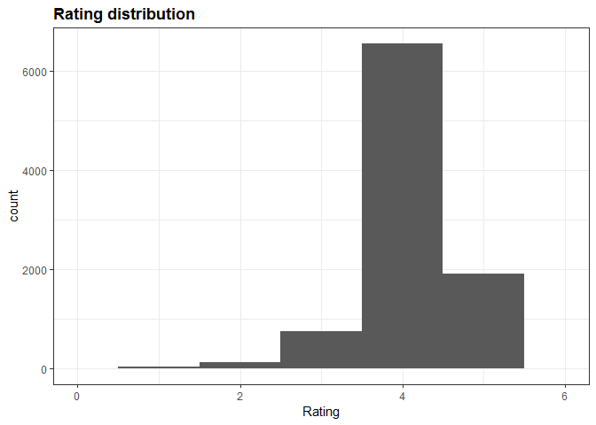
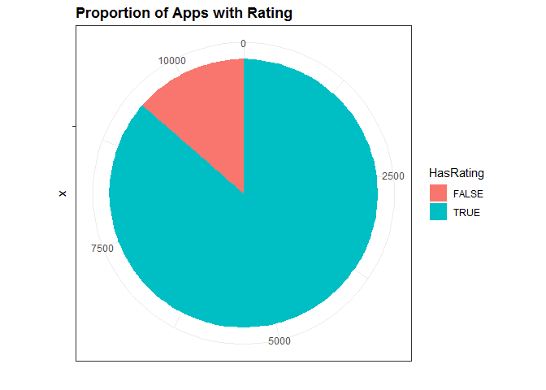

Google Play Apps
================

Data Visualization of Google Play Apps
======================================

Dataset Description
-------------------

Dataset downloaded from: <https://www.kaggle.com/lava18/google-play-store-apps>

Loading the dataset

``` r
library(tidyverse)
library(ggplot2)
library(lattice)
library(latticeExtra)
library(lubridate)
library(dslabs)

ds_theme_set()
apps_dataset_original = read.csv("../../data/googleplaystore.csv", header = TRUE, sep = ",")

#class(apps_dataset)
head(as.tibble(apps_dataset_original))
```

    ## # A tibble: 6 x 13
    ##   App   Category Rating Reviews Size  Installs Type  Price Content.Rating
    ##   <fct> <fct>     <dbl> <fct>   <fct> <fct>    <fct> <fct> <fct>         
    ## 1 Phot~ ART_AND~    4.1 159     19M   10,000+  Free  0     Everyone      
    ## 2 Colo~ ART_AND~    3.9 967     14M   500,000+ Free  0     Everyone      
    ## 3 U La~ ART_AND~    4.7 87510   8.7M  5,000,0~ Free  0     Everyone      
    ## 4 Sket~ ART_AND~    4.5 215644  25M   50,000,~ Free  0     Teen          
    ## 5 Pixe~ ART_AND~    4.3 967     2.8M  100,000+ Free  0     Everyone      
    ## 6 Pape~ ART_AND~    4.4 167     5.6M  50,000+  Free  0     Everyone      
    ## # ... with 4 more variables: Genres <fct>, Last.Updated <fct>,
    ## #   Current.Ver <fct>, Android.Ver <fct>

Data wrangling
--------------

Let's confirm the column types are correct and also the values.

### App Feature

From previous point, we can see the App column, which contains app names, is factor data type, we need to change it to character.

``` r
apps_dataset_original = read.csv("../../data/googleplaystore.csv", header = TRUE, sep = ",", as.is = c("App"))

head(as.tibble(apps_dataset_original))
```

    ## # A tibble: 6 x 13
    ##   App   Category Rating Reviews Size  Installs Type  Price Content.Rating
    ##   <chr> <fct>     <dbl> <fct>   <fct> <fct>    <fct> <fct> <fct>         
    ## 1 Phot~ ART_AND~    4.1 159     19M   10,000+  Free  0     Everyone      
    ## 2 Colo~ ART_AND~    3.9 967     14M   500,000+ Free  0     Everyone      
    ## 3 U La~ ART_AND~    4.7 87510   8.7M  5,000,0~ Free  0     Everyone      
    ## 4 Sket~ ART_AND~    4.5 215644  25M   50,000,~ Free  0     Teen          
    ## 5 Pixe~ ART_AND~    4.3 967     2.8M  100,000+ Free  0     Everyone      
    ## 6 Pape~ ART_AND~    4.4 167     5.6M  50,000+  Free  0     Everyone      
    ## # ... with 4 more variables: Genres <fct>, Last.Updated <fct>,
    ## #   Current.Ver <fct>, Android.Ver <fct>

### Rating feature

Let's take a look at those features that contains NAs

``` r
colnames(apps_dataset_original)[colSums(is.na(apps_dataset_original)) > 0]
```

    ## [1] "Rating"

Let's confirm how many observations there are with NA

We see Rating column is numeric

``` r
class(apps_dataset_original$Rating)
```

    ## [1] "numeric"

Therefore those recods are missing, it may be due to:

    * They are new and therefore there are no yet any rating
    * There may be a new version with no ratings yet.
    * Missing value
    * It may be around for a while and it has no download (or almost none)

``` r
apps_without_ratings <-  apps_dataset_original %>% 
  filter(is.na(Rating)) %>%
  nrow()

sprintf("There are %d without ratings", apps_without_ratings)
```

    ## [1] "There are 1474 without ratings"

**So far we are going to keep the observations that no contains ratings**

Let's explore the Ratings... we are going to convert them in categorical data to see the values easily

``` r
apps_dataset_original %>% 
  mutate(RatingTemp = round(Rating)) %>%
  filter(!is.na(RatingTemp)) %>%
  select(Rating, RatingTemp) %>%
  group_by(RatingTemp) %>%
  summarize()
```

    ## # A tibble: 6 x 1
    ##   RatingTemp
    ##        <dbl>
    ## 1          1
    ## 2          2
    ## 3          3
    ## 4          4
    ## 5          5
    ## 6         19

We found that there are **Ratings of 19!!!** this is not expected

Let take a closer look

``` r
apps_dataset_original %>%
  mutate(RatingTemp = round(Rating)) %>%
  group_by(RatingTemp) %>%
  summarize(count = n())
```

    ## # A tibble: 7 x 2
    ##   RatingTemp count
    ##        <dbl> <int>
    ## 1          1    20
    ## 2          2   130
    ## 3          3   583
    ## 4          4  6716
    ## 5          5  1917
    ## 6         19     1
    ## 7        NaN  1474

Validating if there are more Ratings out of range

``` r
apps_dataset_original %>% 
  filter(Rating > 5.0 | Rating < 0) %>%
  count()
```

    ## # A tibble: 1 x 1
    ##       n
    ##   <int>
    ## 1     1

**There is only one app with Rating 19, it may be 1.9, I am taking the decision of changing the value to 1.9**

``` r
apps_dataset <- apps_dataset_original
head(as.tibble(apps_dataset$Rating))
```

    ## # A tibble: 6 x 1
    ##   value
    ##   <dbl>
    ## 1   4.1
    ## 2   3.9
    ## 3   4.7
    ## 4   4.5
    ## 5   4.3
    ## 6   4.4

``` r
rating_indexes <- !is.na(apps_dataset[,3]) & apps_dataset[,3] > 5.0

apps_dataset[rating_indexes,3] <- apps_dataset[rating_indexes,3] * 0.1
```

Validating the change has been applied

``` r
apps_dataset %>%
  mutate(RatingTemp = round(Rating)) %>%
  group_by(RatingTemp) %>%
  summarize(count = n())
```

    ## # A tibble: 6 x 2
    ##   RatingTemp count
    ##        <dbl> <int>
    ## 1          1    20
    ## 2          2   131
    ## 3          3   583
    ## 4          4  6716
    ## 5          5  1917
    ## 6        NaN  1474

``` r
apps_dataset %>%
  ggplot(aes(x= Rating))+
  coord_cartesian(xlim = c(0,6)) +
  geom_histogram(bins=5) + 
  ggtitle("Rating distribution")
```

    ## Warning: Removed 1474 rows containing non-finite values (stat_bin).



Taking a look at the proportion between those that don't have Ratings

``` r
apps_dataset %>% 
  mutate(HasRating = !is.na(Rating)) %>%
  ggplot(aes(x ="", fill = HasRating)) +
  geom_bar() +
  coord_polar(theta = "y") +
  ggtitle("Proportion of Apps with Rating") +
  ylab("")
```



### Reviews Feature

We see this feature is set as factor when it must be numeric

``` r
apps_dataset %>%
  filter(is.na(as.numeric(Reviews))) %>%
  select(App)
```

    ## [1] App
    ## <0 rows> (or 0-length row.names)

So, Reviews contains only numeric entries, so we convert those explicit

``` r
apps_dataset <-  apps_dataset %>% 
  mutate(Reviews = as.numeric(Reviews))

head(as.tibble(apps_dataset))
```

    ## # A tibble: 6 x 13
    ##   App   Category Rating Reviews Size  Installs Type  Price Content.Rating
    ##   <chr> <fct>     <dbl>   <dbl> <fct> <fct>    <fct> <fct> <fct>         
    ## 1 Phot~ ART_AND~    4.1    1183 19M   10,000+  Free  0     Everyone      
    ## 2 Colo~ ART_AND~    3.9    5924 14M   500,000+ Free  0     Everyone      
    ## 3 U La~ ART_AND~    4.7    5681 8.7M  5,000,0~ Free  0     Everyone      
    ## 4 Sket~ ART_AND~    4.5    1947 25M   50,000,~ Free  0     Teen          
    ## 5 Pixe~ ART_AND~    4.3    5924 2.8M  100,000+ Free  0     Everyone      
    ## 6 Pape~ ART_AND~    4.4    1310 5.6M  50,000+  Free  0     Everyone      
    ## # ... with 4 more variables: Genres <fct>, Last.Updated <fct>,
    ## #   Current.Ver <fct>, Android.Ver <fct>

The Reviews feature is now numeric, let's check if there are NAs

``` r
na_counter <-sum(is.na(apps_dataset[,4]))
sprintf("There are %d Reviews with NA", na_counter)
```

    ## [1] "There are 0 Reviews with NA"

So we are done with this feature.

### Size Feature

This feature seems to be useful if we use it as numeric, anyway we need to remove the 'M' character, but we are not sure if there are other measurement units, such as GB, KB, etc.

``` r
apps_dataset %>% 
  mutate(SizeNumeric = as.numeric(Size)) %>%
  filter(is.na(SizeNumeric)) %>% 
  select(Size, SizeNumeric) %>% head(n = 30)
```

    ## [1] Size        SizeNumeric
    ## <0 rows> (or 0-length row.names)

**Interesting** the conversion does not fail, but the converted values are not the expected ones. so we are going to proceed to remove all non numeric characters, following this convention:

    * All values measure using M, will get rid of M, and converted
    * All values measure using k, will get rid of k, and converted into M scale
    * All values measure using +, will get rid of +, and as kept into M scale
    * 'Varies with device' will be set as NA

Those conventions were determined after some data exploration, you can see in the code below all we have remove

``` r
pattern <- "(M[a-zA-Z]+)|([a-jl-zA-LN-Z])"

apps_dataset %>% filter(str_detect(Size, pattern = pattern) & Size != 'Varies with device') %>%
  select(App, Size) %>% 
  group_by(Size) %>%
  summary()
```

    ##      App                 Size  
    ##  Length:0           1,000+ :0  
    ##  Class :character   1.0M   :0  
    ##  Mode  :character   1.1M   :0  
    ##                     1.2M   :0  
    ##                     1.3M   :0  
    ##                     1.4M   :0  
    ##                     (Other):0

So We have detected that also k is added to the app size measurement, the observation is added to the previous list

#### Create new Size column with the numeric type only

``` r
pattern = "([Mk])"
apps_dataset <- apps_dataset %>%
  mutate(SizeNumeric = str_replace(as.character(Size), "Varies with device", "")) %>%
  mutate(SizeNumeric = str_replace(SizeNumeric,pattern = pattern , "")) %>%
  mutate(SizeNumeric = as.numeric(SizeNumeric)) %>%
  filter(!is.na(SizeNumeric)) 
```

    ## Warning in evalq(as.numeric(SizeNumeric), <environment>): NAs introduced by
    ## coercion

``` r
# There are only numeric values
apps_dataset %>%
  #filter(!is.numeric(SizeNumeric)) %>%
  filter(is.na(SizeNumeric)) %>%  
  select(Size, SizeNumeric) %>% 
  count()
```

    ## # A tibble: 1 x 1
    ##       n
    ##   <int>
    ## 1     0

### Install feature

We may need to keep it as factor, but we also will need it as numeric, so we are creating a second column with those values

we need to remove: **",","+" **

``` r
apps_dataset <- apps_dataset %>% 
  mutate(InstallsNumeric = str_replace_all(Installs, "[,*+$]", "")) %>%
  mutate(InstallsNumeric = as.numeric(InstallsNumeric))
  #select(Installs, InstallsNumeric) %>% 
  #head(n = 20)
na_counter <- apps_dataset %>% 
    filter(is.na(InstallsNumeric)) %>%
    count()

sprintf("There are %d NAs", sum(na_counter))
```

    ## [1] "There are 0 NAs"

### Price feature

The price feature is set as factor, we need to convert it to numeric

``` r
apps_dataset %>%
  filter(is.na(as.numeric(Price))) %>%
  group_by(Type) %>%
  select(Type) %>%
  summary()
```

    ##    Type  
    ##  0   :0  
    ##  Free:0  
    ##  NaN :0  
    ##  Paid:0

There are no NAs

Let's validate there are no format characters

``` r
apps_dataset %>%
  filter(str_detect(Price,pattern = "[a-zA-Z,$]")) %>%
  select(Price) %>%
  head()
```

    ##   Price
    ## 1 $4.99
    ## 2 $4.99
    ## 3 $4.99
    ## 4 $4.99
    ## 5 $6.99
    ## 6 $1.49

There are format characters, so we need to clean up

``` r
apps_dataset <- apps_dataset %>% 
  mutate(PriceNumeric = as.numeric(str_replace_all(Price,pattern = "[a-zA-Z,$]","")))
```

**Is there any Free application with Price different from 0?**

``` r
apps_dataset %>%  filter(Type == 'Free' & Price != '0') %>% count()
```

    ## # A tibble: 1 x 1
    ##       n
    ##   <int>
    ## 1     0

**there is none**

**Is there any not free application but the price is 0?**

``` r
apps_dataset %>%  filter(Type != 'Free' & Price == '0') %>% count()
```

    ## # A tibble: 1 x 1
    ##       n
    ##   <int>
    ## 1     0

**Also there is none**

We didn't get any NA message when converting the Price column, but we are going to double check

``` r
apps_dataset %>%
  filter(is.na(PriceNumeric)) %>%
  count()
```

    ## # A tibble: 1 x 1
    ##       n
    ##   <int>
    ## 1     0

Let's check what is the max and min prices (for min we are expecting 0)

``` r
apps_dataset %>%  
  select(PriceNumeric) %>%
  summary(PriceNumeric) 
```

    ##   PriceNumeric    
    ##  Min.   :  0.000  
    ##  1st Qu.:  0.000  
    ##  Median :  0.000  
    ##  Mean   :  1.184  
    ##  3rd Qu.:  0.000  
    ##  Max.   :400.000

### Last updated feature

We also need to set the dates in a valid format

Let's see if there are more than one format

``` r
pattern = "[a-zA-Z]{3,9}\\s[0-9]{1,2},\\s[0-9]{4}"

match_counter <- apps_dataset %>% filter(str_detect(as.character(Last.Updated), pattern =  pattern)) %>% count()
sprintf("Matching %d of %d", sum(match_counter), nrow(apps_dataset))
```

    ## [1] "Matching 9145 of 9145"

So all dates seem to be in the same format, so we can convert.

``` r
apps_dataset <- apps_dataset %>%
  mutate(Last.UpdatedDate = mdy(Last.Updated))

head(as.tibble(apps_dataset$Last.UpdatedDate))
```

    ## # A tibble: 6 x 1
    ##   value     
    ##   <date>    
    ## 1 2018-01-07
    ## 2 2018-01-15
    ## 3 2018-08-01
    ## 4 2018-06-08
    ## 5 2018-06-20
    ## 6 2017-03-26

Record Counting
---------------

How many apps are there?

``` r
rows_total <- nrow(apps_dataset)
rows_without_na <- nrow(na.omit(apps_dataset))

sprintf("Total apps %d", rows_total)
```

    ## [1] "Total apps 9145"

``` r
sprintf("Total apps %d, removing na", rows_without_na)
```

    ## [1] "Total apps 7729, removing na"
